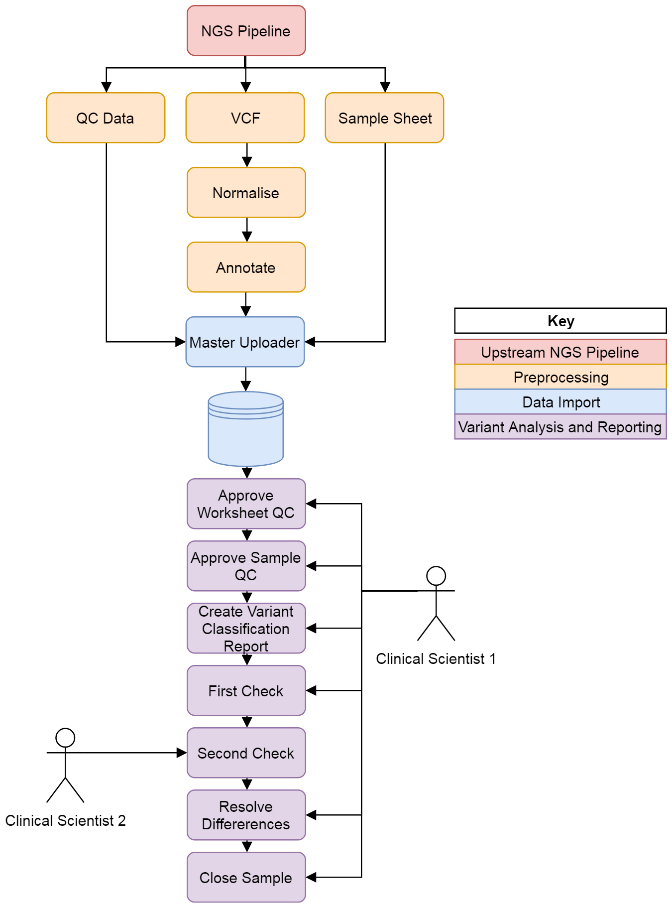
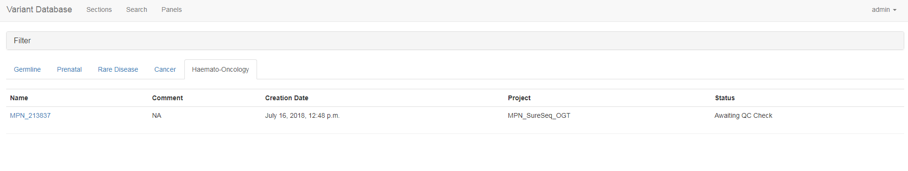
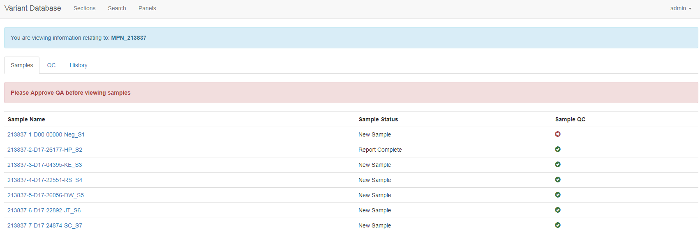
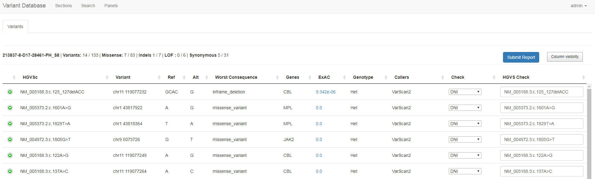

# WMRGL Variant Database User Guide

## Document Purpose

This document should be read by users of the West Midlands Regional Genetics Laboratory (WMRGL) Variant Database.

## Introduction

The WMRGL Variant Database is a software system for storing, analysing and retrieving information about the genetic variants found in Next Generation Sequencing (NGS) assays run within the laboratory. 

The software has the following key features:

1.	Users can conduct sample tracking and view sample and run metadata.
2.	Users can view information about a specific NGS run. For example the user can view the variants within the run VCF as well as quality control metrics.
3.	Record information about variants. Users can store comments, evidence and classifications about variants discovered in the laboratory.
4.	View information that other users have recorded in the database.

The flow of data within the database can be seen in Figure 1.

**Figure 1.** How data flows through the database.

## Logging In

In order to create an account please contact the administrator of the database. The current administrator of the database is Joseph Halstead (joseph.halstead@bwnft.nhs.uk). The administrator will then provide you with a username and password which you can use to login. It is **very important** that you then change your password. See the User Settings section of this document for more details on how to achieve this.

The user can logout by selecting their username on the upper right on the top toolbar. A menu will then appear allowing the user to logout.

## List NGS Runs

This section describes how a user should access the list of available NGS runs. An NGS run can have many samples. To view the available runs select the ‘Sections’ tab at the top of the page. The runs are then separated into different sections. Select the relevant section. The NGS runs will then become visible. Each run has data also has data associated with it and this will be displayed in the table. To view more information on a particular run click the run name.

**Figure 2.** The Section page which allows the user to view a list of NGS runs.

## View Information on a Specific Run

Once the user has selected the run name they will be taken to the run detail page (Figure 2). This page shows detail about a particular NGS run. The user can view:

1.	The samples in a run.
2.	Run Level QC e.g. InterOp data.
3.	History of the run.

On the Samples tab a table is shown with the sample name, sample status and sample QC. On the QC tab the user can view QC statistics as well as approve the QC. The history tab shows an audit log of the changes that have occurred to that run as well as allowing the changing of the run status e.g. to complete. To get more information of a specific sample on a run select the sample name link.

**Figure 3.** The Run Detail page. Note that a warning will be shown if the Run Level QC has not been approved.

## View Sample Information

Once the user has selected the sample name link they will be taken to the sample detail page. This page has the following information available: 

### Variant Information

The variant information tab shows a list of (filtered) variants found in the laboratory. 

### Variant Filter

The user can view and change the filtering settings. The user can select the frequency, consequence and gene panel.

### QC Information

The user can view the quality control metrics for that run. These statistics are generated by bamstats.

### Coverage Information

The user can view the coverage of the assay. Gene level and exon level are availible.

### History Information

The history of any changes to the sample e.g. status can be viewed here. The status can also be changed.

### Report Information

This page allows the user to create and view previous reports.

## Variant Reports

In the WMRGL Variant Database a report records a clinical scientist decision about the variants found in the sample. For example the user may decide that a one particular variant is pathogenic whilst another is benign.

A user can create a report from the View Sample Information page. The user can select the 'Report' tab and then selects 'Create New'. The user is then presented with a page which shows each of the filtered variants for that sample. Note that the gene filter seen in the 'Filter' tab in the View Sample Information page is applied when creating a new report. The user can then select a classification for each variant and change the HGVS if needed. The user then submits the report by selecting the 'Submit Report' button.

This stage is then repeated by a second user. If both users agree then the rpeort is marked as complete. If the users disagree then the report status will be changed to 'Awaiting Resolution' and a user will have to select a final classification for each variant.

**Figure 4.** The reporting page.

## Search for a Variant

The database also allows users to search for variants. Navigate to the search page by selecting 'Search' in the upper toolbar. The user can search using the gene name, position, region or sample name. Example searches are provided on this page.

## User Settings

The user has the ability to change their user settings. The user selects their usename from the top right of the toolbar and selects the 'Settings' option. The user is then given the option to change their password and change the default view on the sample detail page. 

## FAQ

**I don't have the option to change a run or sample status - Why not?**

Within the database system each user can assigned into one of three roles:

1. Viewer
2. Analyst
3. Senior Analyst

Only users with a 'Senior Analyst' role can update sample or run statues. Please contact the database administator to upgrade your permissions.

## Abbreviations

WMRGL - West Midlands Regional Genetics Laboratory

VCF - Variant Call Format

NGS - Next Generation Sequencing

QC - Quality Control
